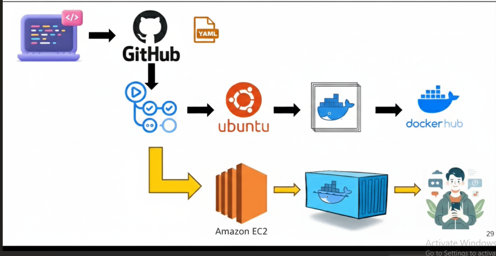
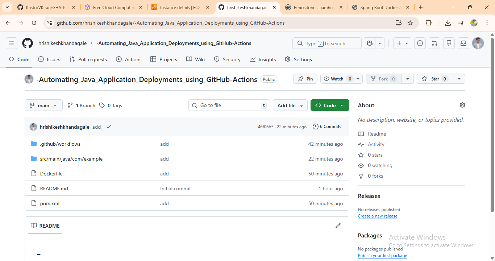
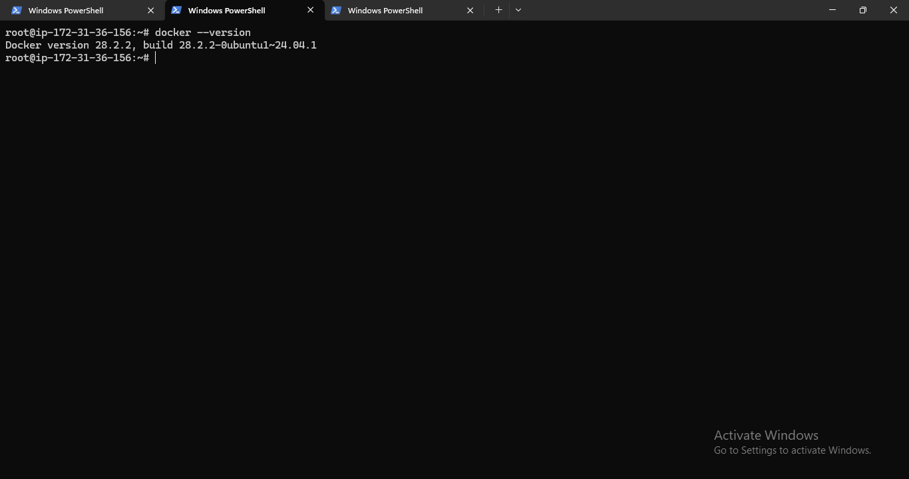
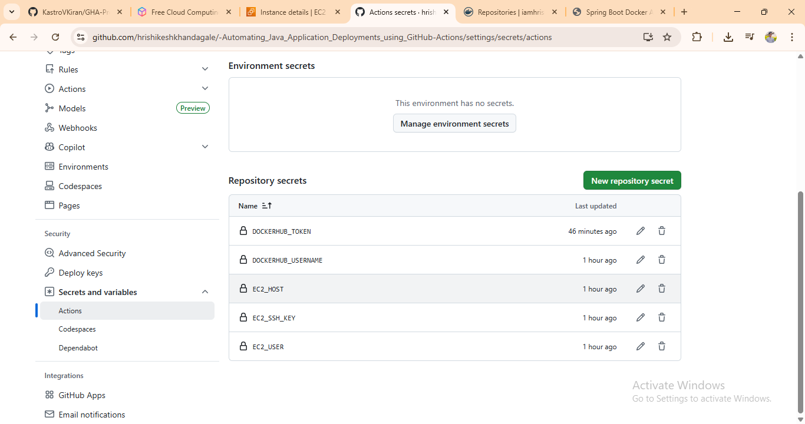
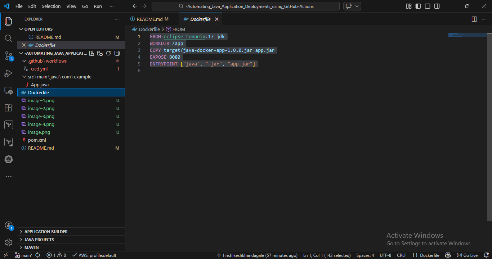
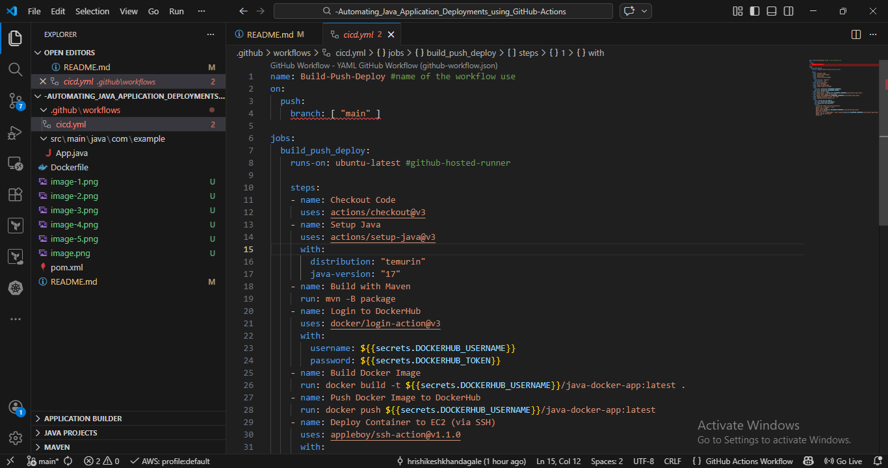
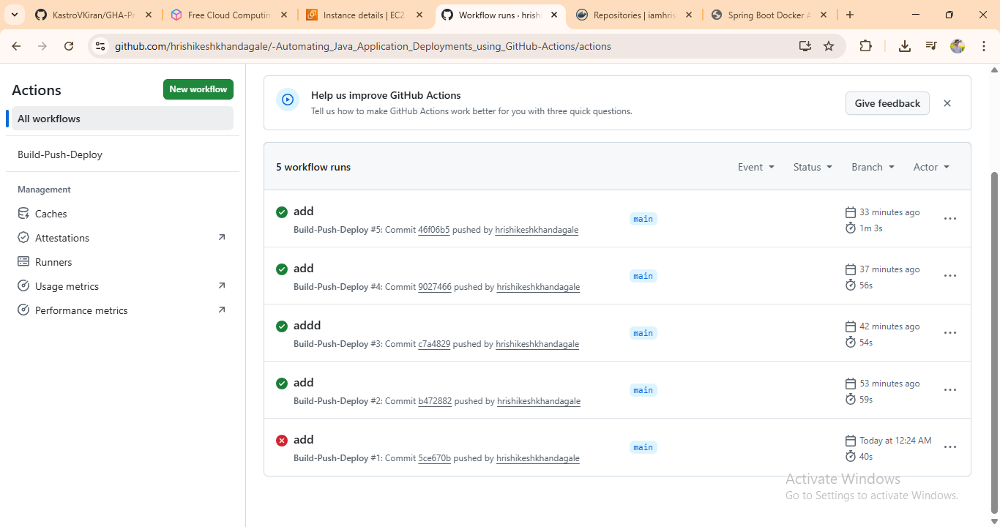
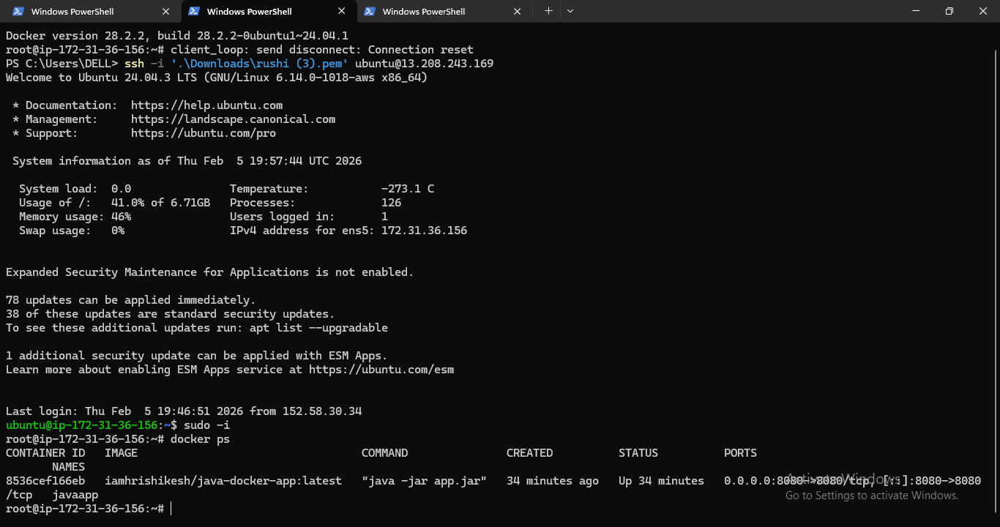
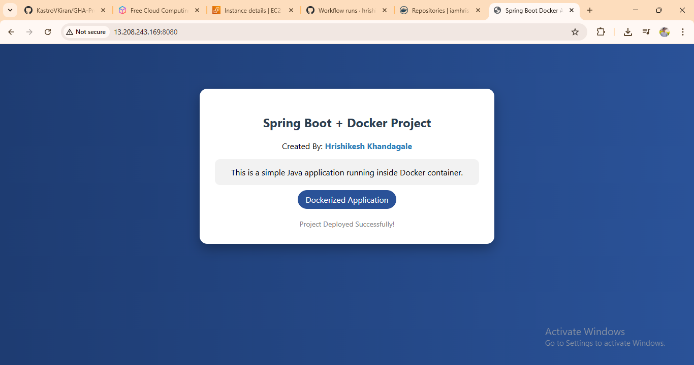

# Automating Java Application Deployment using GitHub Actions

## 📌 Project Overview

This project demonstrates CI/CD automation for a Spring Boot application using GitHub Actions and Docker.

The main goal of this project is to automate:

- Build process  
- Docker image creation  
- Docker image push to Docker Hub  
- Application deployment  

All these steps are performed automatically using a GitHub Actions workflow.

---

## 🛠 Technologies Used

- Java 17  
- Spring Boot  
- Maven  
- Docker  
- GitHub Actions  
- Docker Hub  
- Linux / EC2 (Deployment)

---

## 🚀 Features

- Spring Boot web application  
- Dockerized application  
- Automated CI/CD pipeline  
- Automatic build on code push  
- Docker image push to Docker Hub  
- Automated deployment using SSH  

---

## 📁 Project Architecture

### Step 1: Repository Setup

- Created a new repository on GitHub  
- Added project files and Dockerfile  
- Cloned the repository locally for further development

### Step 2: EC2 Setup and Docker Installation

- Launched an Ubuntu EC2 instance in AWS  
- Connected to the instance via SSH  
- Updated the package repository:
  sudo apt update

- Installed Docker engine on the system  
- Started and enabled Docker service  
- Verified successful installation with:
  docker --version

### Step 3: Add GitHub Secrets

- Created Docker Hub access token  
- Stored Docker Hub credentials in GitHub Secrets  
- Added EC2 public IP and key pair as secrets  
- Secured all sensitive information inside GitHub repository settings

### Step 4: Dockerfile Creation

- Created a Dockerfile for the application  
- Added required build and run instructions  
- Prepared the project for containerization

### Step 5: CI/CD Workflow Creation

- Created cicd.yml file in GitHub Actions  
- Automated Docker build and push process  
- Implemented CI/CD pipeline using GitHub Actions

### Step 6: Trigger CI/CD Pipeline

- Pushed code to GitHub repository  
- Checked GitHub Actions workflow execution  
- Verified successful Docker image build and push

### Step 7: Validate Deployment

- Verified Docker container status on EC2 instance  
- Checked running containers using docker ps  
- Confirmed application is running successfully

### Step 8: Final Verification

- Accessed the application using EC2 public IP  
- Confirmed the server is live and running  
- Deployment successfully completed 

V---

## 👤 Author

**Name:** Hrishikesh Khandagale   
**GitHub:** https://github.com/hrishikeshkhandagale
**LinkedIn:** https://www.linkedin.com/in/hrishikesh-khandagale-0b5b27387/
---

### 📌 Project Developed as part of DevOps Learning Journey 🚀
